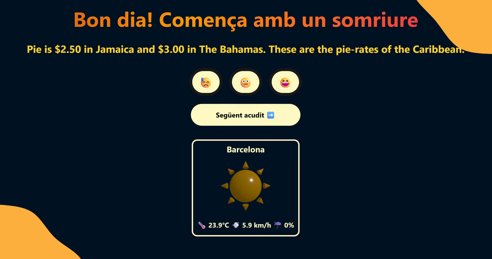
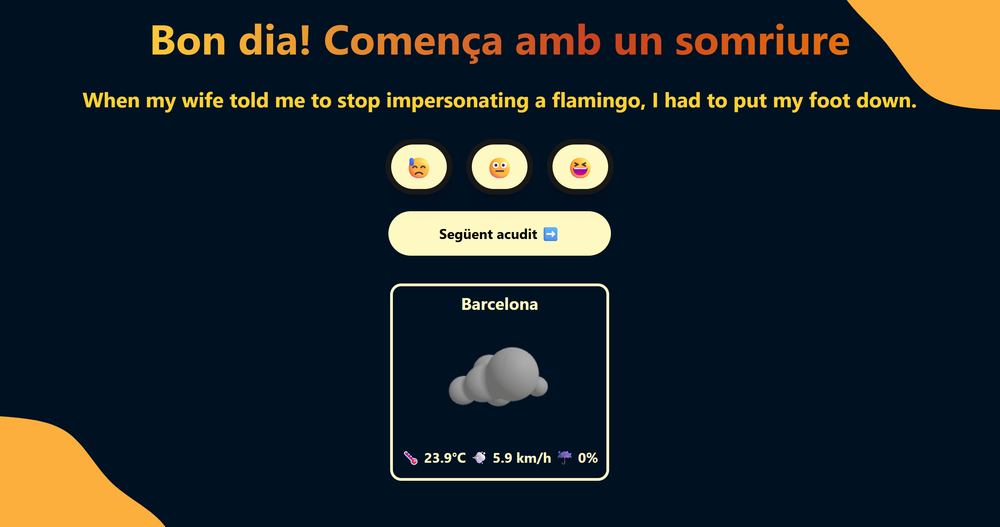
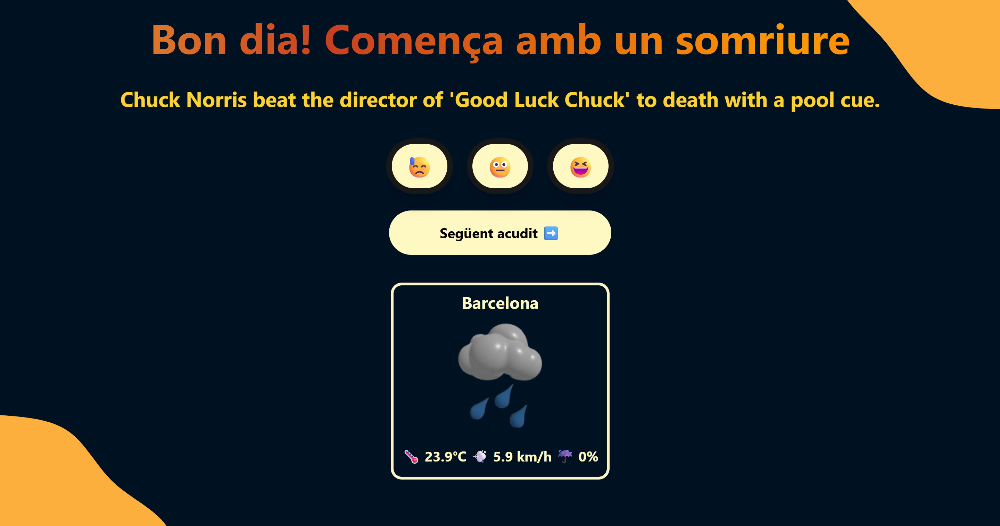
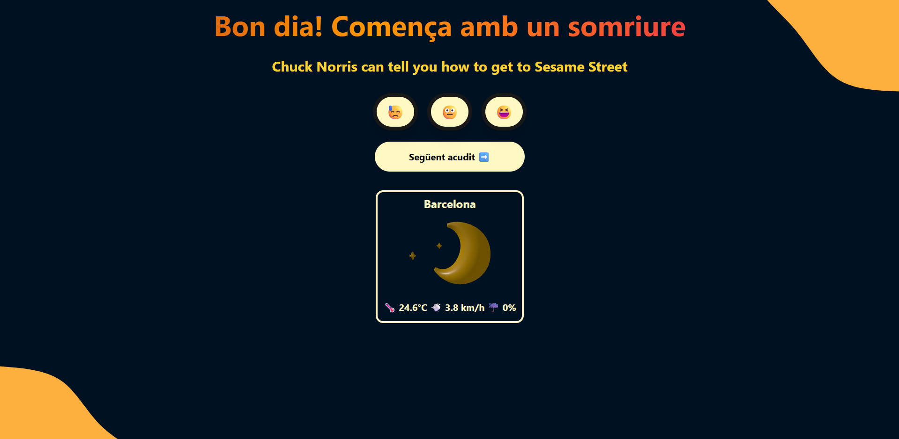

# 🧩 Test Level - FizzBuzz


## 🧠 Goals

- Put into practice API concepts.
- Good use of DOM manipulation.
- Using typescript correctly.

## 📝 Key Tasks for the project

- Consume 2 joke APIs and display them on screen.
- Build a Joke scorer.
- Consume a weather API and display it on screen.
- Make a responsive and improved design

## 🎥 Preview

### 🛍️ Jokes and weather app View


---

### ☀️ Sun


---

### ☁️ Cloud


---

### 🌦️ Rain


---

### 🌙 Night


---


## 🛠️ Getting Started

### 1️⃣ Clone this repository

```bash
https://github.com/JlBestMc/S4.-Typescript-API.git

```

### 2️⃣ Install Dependencies

Make sure you have Node.js installed. Then install the packages:

```bash
npm install
```

## 📁 Project Structure

```
📦 E-commerce
┣ 📂 public
┣ 📂 src/
      ┣ 📂 api
         ┣ 📄 jokesApi.ts  
         ┗ 📄 weatherApi.ts 
      ┣ 📂 core
         ┗ 📄 reports.js
      ┣ 📂 types
         ┗ 📄 interfaces.ts  
      ┣ 📂 ui
         ┣ 📄 animations.js 
         ┣ 📄 style.css
         ┣ 📄 uiJokes.ts  
         ┣ 📄 uiWeather.ts
         ┗ 📄 weather3D.ts  
      ┗ 📄 main.js
┗ 📄 index.html

```

## 🛠 Technologies Used

    - JavaScript
    - TypeScript
    - HTML
    - CSS (Tailwind)
    - Gsap.js
    - Three.js
    - Blender


## ⏳ Project Status


